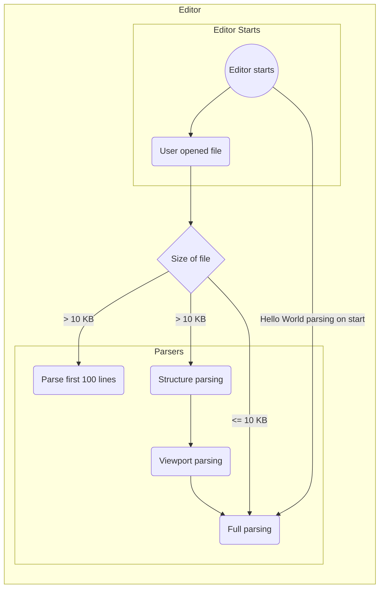

```mermaid
graph LR
    subgraph Editor
        subgraph Editor Starts
            Sa0((Editor starts))
            Sa1(User opened file)

            Sa0-->Sa1
        end
        
        subgraph Parsers
            Sp0(Parse first 100 lines)
            Sp1(Structure parsing)
            Sp2(Viewport parsing)
            Sp3(Full parsing)
            
            Sp1 --> Sp2
            Sp2 --> Sp3
        end
         
       Sa0-->|Hello World parsing on start|Sp3 
       Sa1-->S0
              
       
       S0{Size of file}
       S0 -->| > 10 KB | Sp0
       S0 -->| > 10 KB | Sp1
       S0 -->| <= 10 KB | Sp3

    end
```